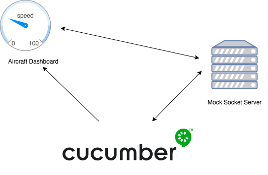

# Aircraft Dashboard



In order for me to write effective tests that didn't require me to change the JS application directly. I decided I would need to point the application to a mock socket server. 

Having a mock socket server I can send JSON via a client connection in my Cucumber step to the server which is relayed to the dashboard.
As well has sending data via the a client connection in the Cucumber steps, I have tested against the messages recieved by the socket client and asserted expected outcomes when certain interractions are executed in the dashboard.

This setup has enabled me to test the dahsboard application as a blackbox.

I've used Cucumber, Capbyara, Selenium and Chrome to test the dashboard and Sinatra to boostrap the client-side application.

Cucumber feature files are located in the features folder.

You will need ruby xxx to run mock-socket-server and Cucumber tests.

Clone this repo and cd into the root and start the mock socket server by the following bash script

```./start-mock-socket-server```

Open another terminal window and cd into the root folder of this project and run the following bash script

```./run-tests```


You can view the dashboard by running the following ``SOCKET_SERVER=ws://localhost:3001 bundle exec thin start -p 8080``` in the terminal and going to http://localhost:8080 in a browser. 

I've written a test client page so you can send data to the dahsboard and watch the dials change. You will also see the messages that are sent from the dashboard when you interact with the dashboard.

The test socket client can be found by visiting http://localhost:8080/socket-client


